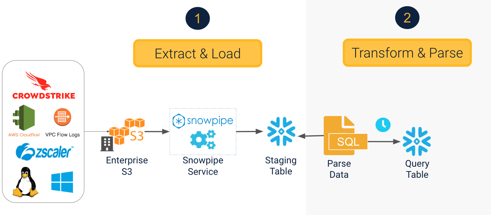

# aws-falcon-data-forwarder

## Create infrastructure and integrate Snowflake

This project is designed to take an FDR feed provided by Crowdstrike and set up a pipeline to retrieve it, parse it and then send it to Snowflake for use by Anvilogic. 


## Architecture

### Stage 1: 

The above lambda function receives SQS message(s) from Crowdstrike Falcon Data Replicator  and transfer log files to your own S3 bucket. This service is deployed as AWS CloudFormation (CFn) stack with SAM technology.

### Stage 2: 


The remainder of the architecture consists of AWS and Snowflake infrastructure and is built out via Terraform. 


## Installing in AWS Cloud Shell via Terraform

- Clone this repo to your Cloudshell home directory: `git clone https://github.com/timfrazier1/aws-falcon-data-forwarder.git `

- Run the setup script: `./cloudshell_setup.sh `

- Substitute your public key from the above script into the commands below and run in your Snowflake environment: 

```
-- Snowflake instructions for pulling Crowdstrike FDR data from S3 and preparing for Anvilogic
use role accountadmin; 

-- Using Snowflake Terraform instructions: 

CREATE USER "tf-snow" RSA_PUBLIC_KEY='<YOUR PUBLIC KEY - WITHOUT HEADER AND FOOTER - GOES HERE>' DEFAULT_ROLE=PUBLIC MUST_CHANGE_PASSWORD=FALSE;

GRANT ROLE SECURITYADMIN TO USER "tf-snow";
GRANT ROLE ACCOUNTADMIN TO USER "tf-snow";

SELECT current_account() as YOUR_ACCOUNT_LOCATOR, current_region() as YOUR_SNOWFLAKE_REGION_ID;
```

- Look for the Account Locator and REGION ID in your output and use those values to fill out the file `snow.env` in the root of this repo.  Make sure you use the [Region reference table](https://docs.snowflake.com/en/user-guide/admin-account-identifier.html#region-ids) to find the right region identifier to use. 
- Run `source snow.env` to bring those variables into your environment
- Update the `example_config.json` file with your Crowdstrike provided SQS queue and the appropriate regions. Move/copy `example_config.json` to a file named `baseconfig.json`
- Rename `terraform/example_main.tf.example` to `terraform/main.tf` and substitute your Crowdstrike provided access key and secret key into the `secret_map` variable
- Run `env FORWARDER_CONFIG=newconfig.json make deploy` and type `yes` when prompted to create infrastructure
- After the first run, look for the output called `Snowpipe_SQS`.  Copy the value for this ARN and paste it into your `terraform/main.tf` file for the variable `snowpipe_sqs_queue_arn` and uncomment that line. 
- Re-run terraform apply with this command: `terraform -chdir=terraform apply`

- Back in Snowflake, run the following commands:
```
ALTER TASK ANVILOGIC.EXTERNAL_STAGING.CROWDSTRIKE_FDR_TASK_IDENTITY set error_on_nondeterministic_merge = false;
ALTER TASK ANVILOGIC.EXTERNAL_STAGING.CROWDSTRIKE_FDR_TASK_ASSET set error_on_nondeterministic_merge = false;
ALTER TASK ANVILOGIC.EXTERNAL_STAGING.CROWDSTRIKE_FDR_TASK_PROCESSROLLUP set error_on_nondeterministic_merge = false;

ALTER TASK ANVILOGIC.EXTERNAL_STAGING.CROWDSTRIKE_FDR_TASK_IDENTITY resume;
ALTER TASK ANVILOGIC.EXTERNAL_STAGING.CROWDSTRIKE_FDR_TASK_ASSET resume;
ALTER TASK ANVILOGIC.EXTERNAL_STAGING.CROWDSTRIKE_FDR_TASK_PROCESSROLLUP resume;
```


# Old Manual Installation Instructions

If you use the above Terraform instructions, you do not need to do any of the below items.  The automation handles this for you. 

## Prerequisites

- Tools
  - go >= 1.11
  - aws-cli https://github.com/aws/aws-cli
- Your AWS resources
  - AWS Credential for CLI (like `~/.aws/credentials` )
  - S3 bucket for log data (e.g. `my-log-bucket` )
  - S3 bucket for lambda function code (e.g. `my-function-code` )
  - Secrets of Secrets Manager to store AWS_ACCESS_KEY_ID and AWS_SECRET_ACCESS_KEY for data replicator.
  - IAM role for Lambda function (e.g. `arn:aws:iam::1234567890:role/LambdaFalconDataForwarder`)
    - s3::PutObject for `my-log-bucket`
    - secretsmanager:GetSecretValue


## Setup

### Setting up AWS Secrets Manager

You need to put AWS API Key (AWS_ACCESS_KEY_ID) and Secret (AWS_SECRET_ACCESS_KEY) provided by CrowdStrike Falcon as secrets of Secrets Manager. Assuming AWS_ACCESS_KEY_ID is `ABCDEFG` and AWS_ACCESS_KEY_ID is `STUVWXYZ`. You can set up the secret by [AWS web console](https://ap-northeast-1.console.aws.amazon.com/secretsmanager).

You need to create 2 items in the secret.

- `falcon_aws_key`: set AWS_ACCESS_KEY_ID provided by CrowdStrike Falcon
- `falcon_aws_secret`: set AWS_SECRET_ACCESS_KEY provided by CrowdStrike Falcon

### Configure

Prepare a configuration file. (e.g. `myconfig.json` ) Please see a following sample.

```json
{
    "StackName": "falcon-data-forwarder-staging",
    "Region": "ap-northeast-1",
    "CodeS3Bucket": "my-function-code",
    "CodeS3Prefix": "functions",

    "RoleArn": "arn:aws:iam::1234567890:role/LambdaFalconDataForwarder",
    "S3Bucket": "my-log-bucket",
    "S3Prefix": "logs/",
    "S3Region": "ap-northeast-1",
    "SqsURL": "https://us-west-1.queue.amazonaws.com/xxxxxxxxxxxxxx/some-queue-name",
    "FalconRegion": "ap-northeast-1",
    "SecretArn": "arn:aws:secretsmanager:ap-northeast-1:1234567890:secret:your-secret-name-4UqOs6"
}
```

- Management
  - `StackName`: CloudFormation(CFn) stack name
  - `Region`: AWS region where you want to deploy the stack
  - `CodeS3Bucket`: S3 bucket name to save binary for lambda function
  - `CodeS3Prefix`: Prefix of S3 Key to save binary for lambda function
- Parameters
  - `RoleArn`: IAM Role ARN for Lambda function
  - `S3Bucket`: S3 Bucket name to save log data
  - `S3Prefix`: Prefix of S3 Key to save log data
  - `S3Regio`: AWS region of `S3Bucket`
  - `SqsURL`: SQS URL provided by CrowdStrike Falcon
  - `FalconRegion`: AWS region of CrowdStrike Falcon S3 Bucket
  - `SecretArn`: ARN of the secret that you store AWS_ACCESS_KEY_ID and AWS_SECRET_ACCESS_KEY

### Deploy

```bash
$ env FORWARDER_CONFIG=myconfig.json make deploy
```

## License

MIT License

